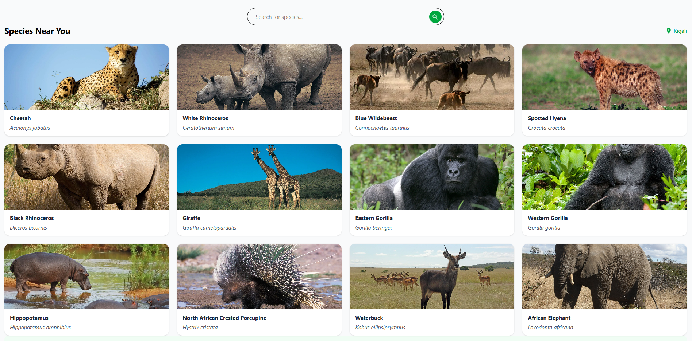
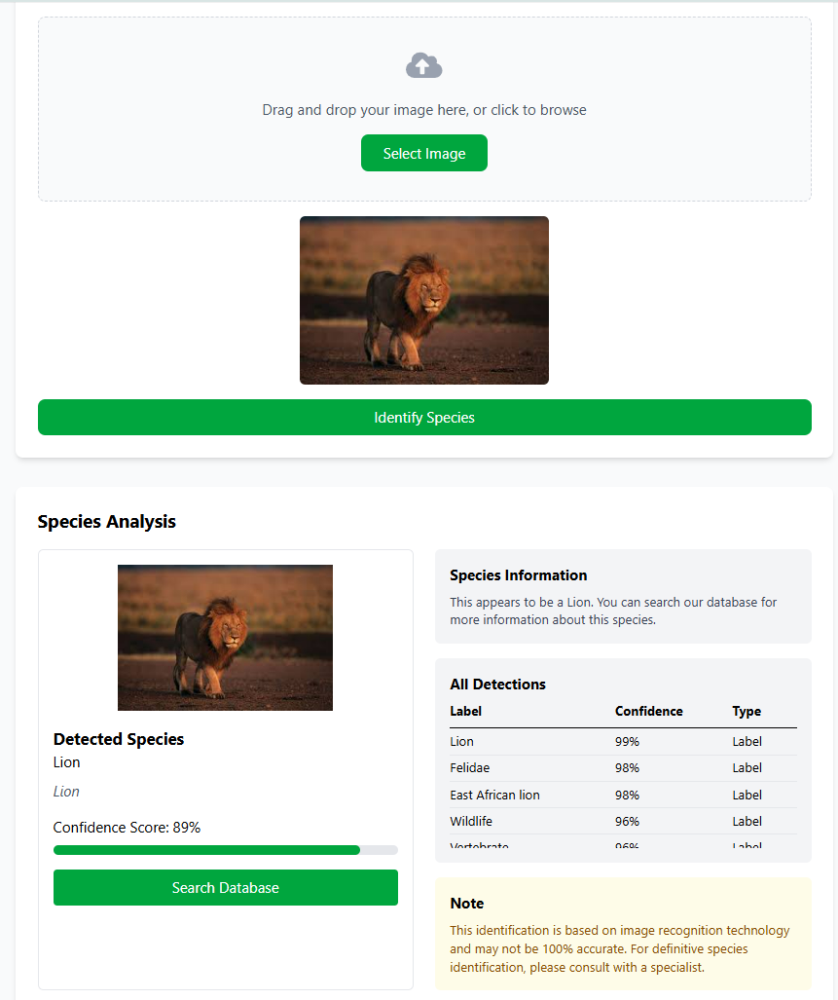
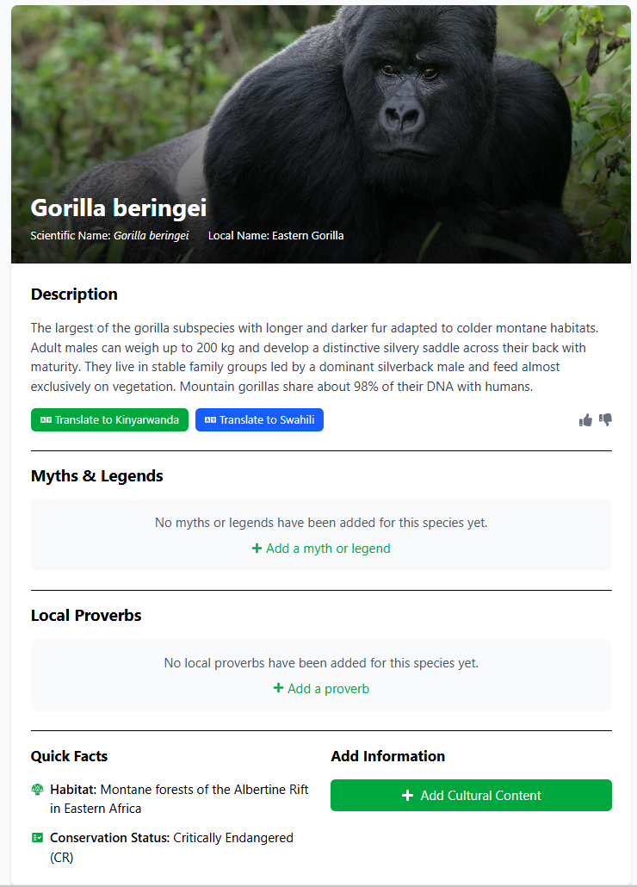

# Biodiversity Education Application 🌿

A web-based platform for exploring biodiversity, contributing cultural knowledge, and engaging in gamified learning.



## Project Structure

- **Frontend**: React app (see [`frontend/README.md`](./frontend/README.md)).
- **Backend**: Node.js API (see [`backend/README.md`](./backend/README.md)).

## Setup

1. Clone the repository

```bash
git clone https://github.com/ekinyua/WildPedia.git

```



2. Install dependencies

```bash
npm install
```

3. Start the server

```bash
npm run dev
```

## Features

- Species exploration via GBIF API
- User-generated content with admin approval
- Gamification (badges, quizzes)
- Photo uploads with Google Vision API
- Localization support



## Tech Stack

- **Frontend**: React, Tailwind CSS
- **Backend**: Node.js, Express, MySQL, Redis
- **Storage**: AWS S3

## Figma Design

https://www.figma.com/design/vOxac0bbbkDZxrBK1nVHdg/Capstone-Project?node-id=56-802&t=Mr8dnlEhp3FLdHZf-1

## Video Recording

## Database Schema

https://drive.google.com/file/d/1FSooS9udCPcSsObXODU5JpMr5S7AnoC_/view?usp=sharing
